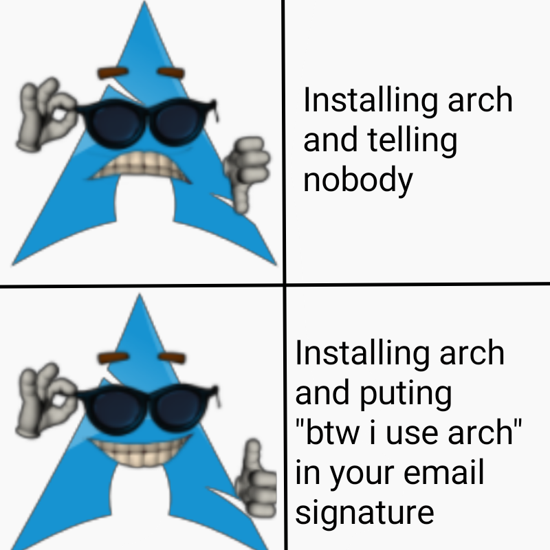
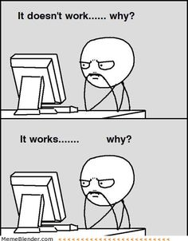

# Why reinvent the wheel?

Most of you might be wondering: **why reinvent the wheel?**

There are already thousands of Linux distributions out there. Ubuntu, Arch, Fedora, Debian, and an unreasonable number of distributions with names you've probably never heard of. So why would anyone in their right mind decide to build an operating system from scratch?

And honestly, you are absolutely right.

There is no practical reason for you to build an OS from scratch. If your goal is to have a computer that actually does useful things, you are probably better off installing Linux and getting on with your life.

In fact, you can now safely close this window and go do something productive.

Random arch meme

...

You still there?

Okay, so I guess you're interested.

The point of this project isn't to create the next Linux or replace Windows. I'm not trying to build an operating system that will somehow dethrone decades of work by thousands of incredibly smart people.

The goal is much simpler:

**I want to understand what actually happens underneath an operating system.**

We use computers every day. We open programs, create files, connect USB devices, type on a keyboard, browse the internet, and somehow all of this just... works. But what actually makes it work?

What happens when the computer is powered on?

How does the processor know where to start executing code?

How does the OS talk to the hardware?

How does a program get loaded into memory?

How does the keyboard somehow convince the CPU that you just pressed the `W` key?

That's what we're going to find out.

We'll start from the very bottom and gradually build our way up. No fancy abstractions, no `printf("Hello World")` hiding five layers of complexity underneath it (well... eventually we'll probably use `printf`, but we'll earn it).

We'll begin with the boot process, write some assembly, make the CPU execute our code, move on to a kernel, interact with hardware, and slowly turn a pile of instructions into something that resembles an operating system.

And yes, things will break.

Probably often.

That's actually part of the fun.

So, if you're still here, congratulations.

**Let's build an OS.**
